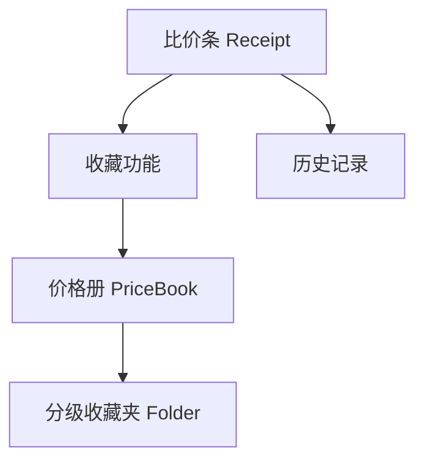

# 均价计算器 - 新功能规划

## 功能概览



---

## 一、历史比价记录

### 功能描述
- 自动保存每次比价计算结果
- 按时间倒序显示历史记录
- 支持查看、删除历史条目

### 数据结构
```typescript
interface HistoryRecord {
  id: string;
  items: ReceiptItem[];       // 该次比价的所有商品
  bestItem: ReceiptItem;      // 最优价格商品
  createdAt: Date;
  totalItemCount: number;
}
```

### UI 建议
- 新增「历史」入口 (Header 区域)
- 历史列表页：卡片式展示，显示日期、商品数、最优价格
- 滑动删除或长按删除

---

## 二、收藏功能

### 功能描述
- 每个比价条可添加**自定义标签** (Tag)
- 新增**收藏按钮** ⭐
- 点击收藏后弹出选择器：
  - 根目录
  - 已有收藏夹
  - 新建收藏夹

### 数据结构
```typescript
interface FavoriteItem extends ReceiptItem {
  tags: string[];             // 用户自定义标签
  folderId: string | null;    // null = 根目录
  favoriteAt: Date;
  note?: string;              // 可选备注
}
```

### UI 流程
```
点击收藏 → 弹出 Modal →
  ├─ 选择: 根目录
  ├─ 选择: 已有收藏夹列表
  └─ 选择: + 新建收藏夹 → 输入名称 → 创建
→ 收藏成功提示
```

### 交互建议
- 收藏按钮位于比价条右上角 (与删除按钮同行)
- 已收藏状态：实心星星 + 高亮色
- 标签输入：支持多个，逗号分隔或回车添加

---

## 三、价格册功能

### 功能描述
- 独立页面展示所有收藏的比价签
- 支持按收藏夹分类浏览
- 支持搜索、筛选标签

### 数据结构
```typescript
interface PriceBook {
  folders: Folder[];
  rootItems: FavoriteItem[];  // 根目录下的收藏
}

interface Folder {
  id: string;
  name: string;
  icon?: string;              // 可选图标
  color?: string;             // 可选颜色
  items: FavoriteItem[];
  createdAt: Date;
  updatedAt: Date;
}
```

### UI 建议
- 底部导航栏新增「价格册」Tab
- 页面布局：
  - 顶部：搜索栏 + 标签筛选
  - 中部：收藏夹网格 / 列表
  - 点击收藏夹进入详情

---

## 四、收藏夹管理

### 功能描述
- 创建 / 重命名 / 删除收藏夹
- 移动收藏项到其他文件夹
- 收藏夹支持自定义颜色/图标

### 操作流程
| 操作 | 触发方式 | 说明 |
|------|----------|------|
| 新建 | 收藏时选择 / 价格册页面 + 按钮 | 输入名称即可 |
| 重命名 | 长按收藏夹 / 编辑模式 | 弹出输入框 |
| 删除 | 长按 / 编辑模式 | 确认弹窗，内容移至根目录 |
| 移动 | 收藏项长按 → 移动 | 选择目标文件夹 |

---

## 存储方案

建议使用 **localStorage + IndexedDB** 组合：

| 数据 | 存储 | 原因 |
|------|------|------|
| 设置、主题 | localStorage | 轻量、同步 |
| 历史记录 | IndexedDB | 数据量大、需索引 |
| 收藏 & 文件夹 | IndexedDB | 结构复杂、需查询 |

---

## 新增文件建议

```
src/
├── types/
│   └── favorites.ts         # 收藏相关类型
├── hooks/
│   ├── useHistory.ts        # 历史记录 Hook
│   ├── useFavorites.ts      # 收藏操作 Hook
│   └── usePriceBook.ts      # 价格册 Hook
├── components/
│   ├── common/
│   │   ├── Modal.tsx        # 通用弹窗
│   │   ├── TagInput.tsx     # 标签输入组件
│   │   └── FolderPicker.tsx # 收藏夹选择器
│   ├── history/
│   │   └── HistoryPage.tsx
│   └── pricebook/
│       ├── PriceBookPage.tsx
│       ├── FolderCard.tsx
│       └── FavoriteCard.tsx
├── services/
│   └── storage.ts           # IndexedDB 封装
└── App.tsx                  # 添加路由/页面切换
```

---

## 开发顺序建议

1. **Phase 1**: 存储层 (`storage.ts`) + 类型定义
2. **Phase 2**: 历史记录功能 (独立，无依赖)
3. **Phase 3**: 收藏功能 + 收藏夹选择器
4. **Phase 4**: 价格册页面 + 文件夹管理
